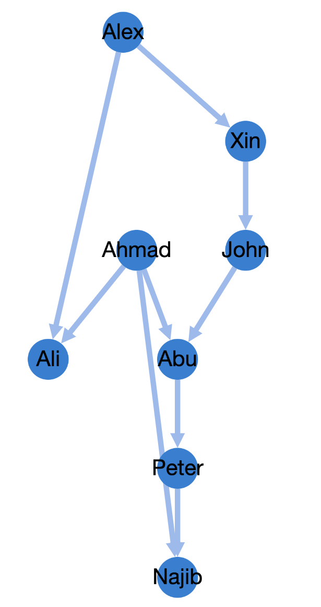

<h1> Visualize Graph Network </h1>

    <h2>Objective</h2>
    <ol>
        <li>Create Graph Data Structure</li>
    <ol>

 

    <h2>How</h2>
    <ol>
        <li>Create data and save into json using <samp>graph_main.py</samp> or <samp>graph_main.js</samp></li>
    <ol>

 

    <h2>Result</h2>
    
    
    

 

    <h2>Main npm libraries</h2>
    <ol>
        <li>cytoscape</li>
        <li>cytoscape-avsdf</li>
        <li>cytoscape-dagre</li>
    <ol>

