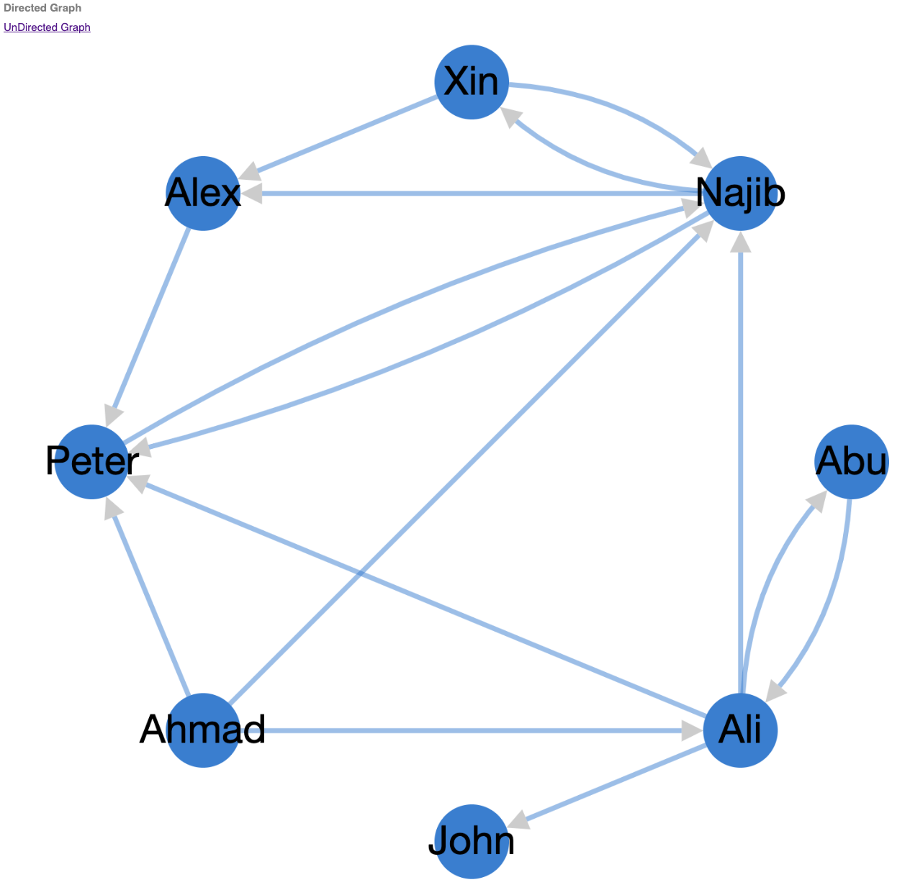
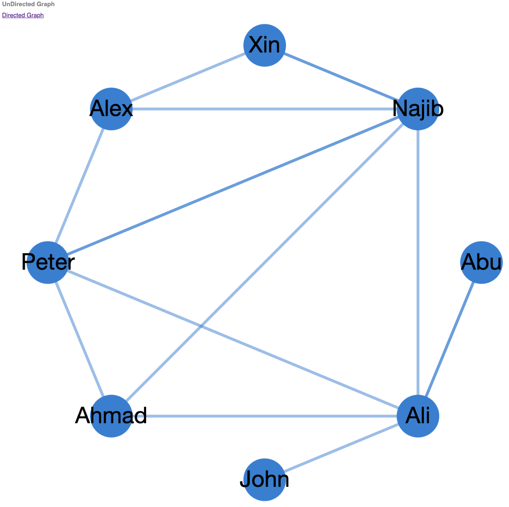

<h1> Visualize Graph Network </h1>

    <h2>Objective</h2>
    <ol>
        <li>Create Graph data structure using linked list</li>
        <li>Create json file containing edges and nodes</li>
        <li>Visualize using npm libraries in browsers</li>
    <ol>

 

    <h2>Steps</h2>
    <ol>
        <li>Run <samp>graph_main.py</samp> or <samp>graph_main.js</samp> to save data as json file</li>
        <li>Pass data to argument (1) sample can be seen in <samp>sample_data.txt</samp></li>
        <li>View the HTML file</li>
    <ol>

 

    <h2>Sample result</h2>
    
    

 

    <h2>Main npm libraries</h2>
    <ol>
        <li>cytoscape</li>
        <li>cytoscape-avsdf</li>
    <ol>

